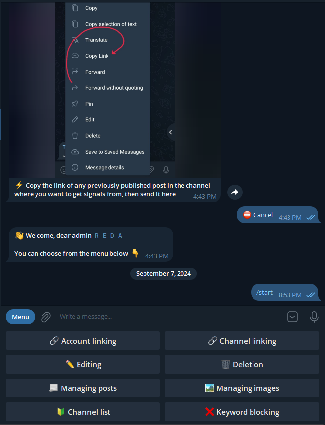

  
  
  # 🚀 TeleSync Pro
  ## *The Ultimate Telegram Content Synchronization Solution*
  
  

Automate your Telegram channel management with our enterprise-grade bot that instantly forwards and synchronizes content between channels in real-time with perfect accuracy.

### 💰 **Why Choose TeleSync Pro?**

<table>
<tr>
<th>❌ <strong>Manual Management Problems</strong></th>
<th>✅ <strong>TeleSync Pro Solutions</strong></th>
</tr>
<tr>
<td><strong>Missing Important Messages</strong> 
Manual copying leads to missed content</td>
<td><strong>🎯 Instant Content Mirroring</strong> 
Messages forwarded in the same millisecond</td>
</tr>
<tr>
<td><strong>Delayed Content Sharing</strong> 
Time lag between channels hurts engagement</td>
<td><strong>⚡ Real-Time Edit Sync</strong> 
When source edits, target updates automatically</td>
</tr>
<tr>
<td><strong>Copy-Paste Errors</strong> 
Manual work creates formatting mistakes</td>
<td><strong>🔄 Perfect Replication</strong> 
Exact copy with preserved formatting and media</td>
</tr>
<tr>
<td><strong>No Edit Synchronization</strong> 
Original message changes aren't reflected</td>
<td><strong>📊 Professional Tracking</strong> 
Monitor forwarding performance and statistics</td>
</tr>
<tr>
<td><strong>Limited Availability</strong> 
Can't monitor channels 24/7 manually</td>
<td><strong>🌐 24/7 Operation</strong> 
Never miss content while offline</td>
</tr>
<tr>
<td><strong>Scaling Challenges</strong> 
More channels = exponentially more work</td>
<td><strong>🏢 Scalable Solution</strong> 
Handle unlimited channels effortlessly</td>
</tr>
</table>

---

## 🎯 **Core Features & Benefits**

### **⚡ Lightning-Fast Synchronization**
- **Instant Forwarding**: Messages copied in the same millisecond as source
- **Real-Time Edit Sync**: Automatic updates when original content changes  
- **Perfect Threading**: Maintains reply chains and conversation context
- **Media Support**: Images, videos, documents, and all file types

### **🔄 Advanced Content Management**
- **Reply Threading**: When source channel replies to a message, target channel maintains the same reply structure
- **Edit Synchronization**: Automatically updates forwarded content when original is edited
- **Format Preservation**: Maintains all text formatting, mentions, and hashtags
- **Batch Processing**: Handles high-volume channels efficiently

### **🤖 Telegram Bot Dashboard**
- **Full Control Interface**: Manage your bot directly through Telegram
- **Start/Stop Commands**: Control forwarding with simple commands
- **Channel Management**: Add/remove source and target channels instantly
- **Real-Time Stats**: View performance metrics and forwarding status
- **Settings Control**: Adjust filtering rules and preferences on-the-go
- **Status Monitoring**: Get instant alerts and system notifications

 <em>Professional Dashboard Interface - Control Everything From Telegram</em>

---

## 💼 **Perfect For:**

<table>
<tr>
<th>📢 <strong>Content Creators & Publishers</strong></th>
<th>🏪 <strong>Business & Organizations</strong></th>
<th>👨‍💼 <strong>Channel Managers & Marketers</strong></th>
</tr>
<tr>
<td>• Automate content distribution across multiple channels 
• Maintain consistent posting schedule 24/7 
• Reduce operational overhead and manual errors 
• Scale to unlimited channels effortlessly</td>
<td>• Eliminate manual content management costs 
• Improve audience engagement with instant updates 
• Professional analytics for content optimization 
• Enterprise-ready infrastructure for growth</td>
<td>• Never miss important content updates 
• Aggregate content from multiple sources 
• Focus on strategy, not manual forwarding 
• Maintain competitive edge with automation</td>
</tr>
</table>

---

## 💰 **Pricing Plans**

<table>
<tr>
<th>📱 <strong>Plan 1 - Basic</strong></th>
<th>🚀 <strong>Plan 2 - Unlimited</strong></th>
<th>⚙️ <strong>Plan 3 - Custom</strong></th>
<th>💻 <strong>Plan 4 - Source Code</strong></th>
</tr>
<tr>
<td><strong>$50/month</strong></td>
<td><strong>$100/month</strong></td>
<td><strong>Let's Discuss</strong></td>
<td><strong>$500 One-time</strong></td>
</tr>
<tr>
<td>✅ Link 3 source channels 
✅ Forward to 3 target channels 
✅ Real-time synchronization 
✅ Edit sync included 
✅ Basic support 
✅ 24/7 operation</td>
<td>✅ Unlimited source channels 
✅ Unlimited target channels 
✅ Real-time synchronization 
✅ Edit sync included 
✅ Priority support 
✅ Advanced analytics</td>
<td>✅ Custom content formatting 
✅ Style modifications 
✅ Anti-copy detection 
✅ Specific customizations 
✅ Dedicated support 
✅ Tailored to your needs</td>
<td>✅ Complete source code 
✅ Full ownership 
✅ Modify as needed 
✅ Self-hosting 
✅ Documentation included 
✅ No monthly fees</td>
</tr>
<tr>
<td>Perfect for small teams and personal use</td>
<td>Ideal for businesses and large operations</td>
<td>Specialized solutions for unique requirements</td>
<td>Full control and customization freedom</td>
</tr>
</table>

### **🚀 Why Our Pricing Beats Competition:**
- **No Setup Fees**: Start immediately without hidden costs
- **Transparent Pricing**: What you see is what you pay  
- **Flexible Scaling**: Upgrade or downgrade anytime
- **ROI Guaranteed**: Save thousands on manual management

---

## 📞 **Get Started Today**

### **Contact Us Now:**

 **Email:** redaelbettioui@gmail.com

 **LinkedIn:** [Reda EL BETTIOUI 🇵🇸](https://www.linkedin.com/in/reda-el-bettioui/)

 **Telegram:** [https://t.me/reeeeeda](https://t.me/reeeeeda)

 **GitHub:** [Visit Our Repository](https://github.com/XredaX?tab=repositories)

---

## ⚖️ **Legal & Compliance**

### **📋 Intended Use & Responsibility:**
- **TeleSync Pro is designed for use on YOUR OWN channels only**
- Use this bot to synchronize content between your source and target channels
- **We are NOT responsible for any consequences if you use this bot on channels you don't own**
- Users must have full ownership and administrative rights to both source and target channels
- Any misuse on third-party channels is solely your responsibility

---

*© 2025 TeleSync Pro. All rights reserved. Telegram is a trademark of Telegram FZ-LLC.*
